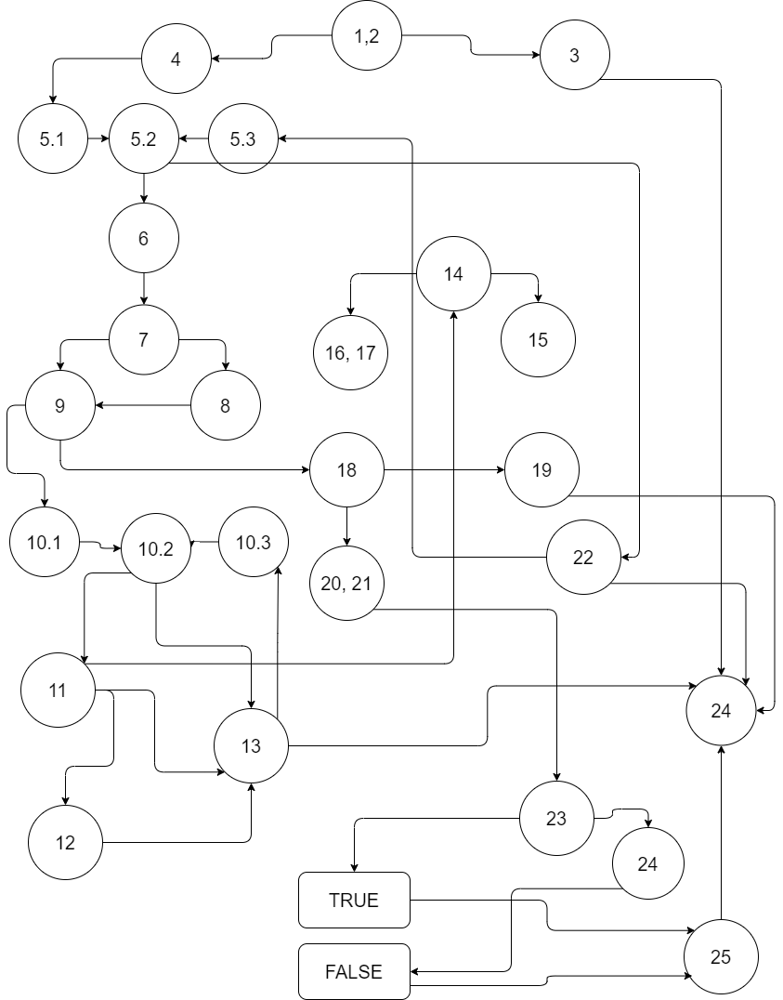

Втора лабораториска вежба по Софтверско инженерство
Антонио Николоски, бр. на индекс 226059

Control Flow Graph

Цикломатска комплексност
Цикломатската комплексност на овој код е 15, истата ја добив преку формулата:
Nodes (25) + Edges (38) = 15

Објаснување на напишаните unit tests
Во функцијата има 3 теста каде што во првите 2 треба да вратат TRUE, 
а последниот FALSE